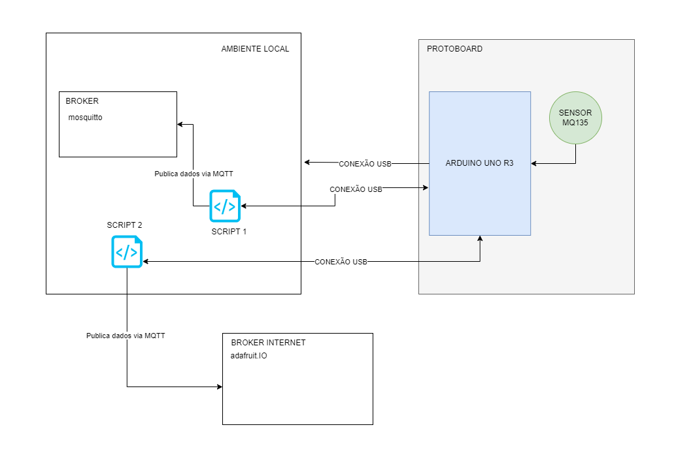
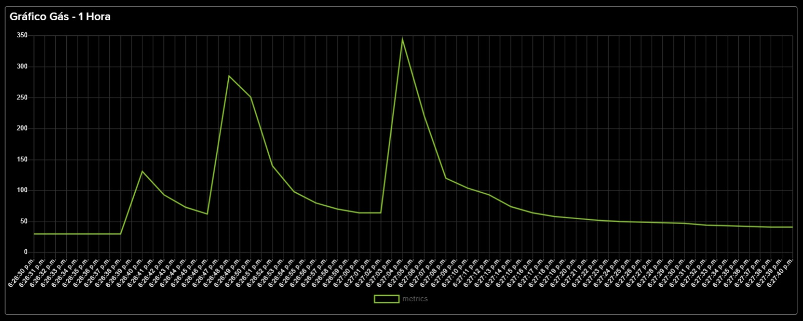
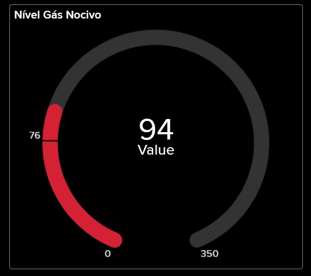

## Monitoramento e Qualidade do Ar

***Abstract.** This article presents the conception of an IoT project focusing on
SDG 3, which addresses health and well-being, with metrics aimed at
achieving sustainable development goals. The project aims to develop a system
to monitor air quality and the presence of gases, contributing to health and
well-being, technological innovation, protection of terrestrial life, and various
applications in the industry.
The architecture involves the use of an MQ-135 sensor, connected to an
Arduino UNO board, which controls and performs actions based on data
collected from the environment, allowing real-time analysis of air conditions.*

***Resumo.** Este artigo apresenta a concepção de um projeto de IoT com foco no
ODS 3, que aborda saúde e bem-estar, com métricas destinadas a alcançar os
objetivos de desenvolvimento sustentável. O projeto visa desenvolver um
sistema para monitorar a qualidade do ar e a presença de gases, contribuindo
para a saúde e bem-estar, inovação tecnológica, proteção da vida terrestre e
diversas aplicações na indústria.
A arquitetura envolve o uso de um sensor MQ-135, conectado a uma placa
Arduino UNO, da qual controla e executa ações com base nos dados coletados
do ambiente, permitindo uma análise em tempo real das condições do ar.*

---

## Arduino e MQ-135: Saúde e Bem Estar

Para realização de nosso projeto montaremos uma arquitetura onde
teremos um sensor de gás e a partir da detecção feita pelo sensor, o
microcontrolador que estiver ligado ao módulo será notificado e poderá tomar
ações determinadas.

## Arquitetura / Hardware

* Placa Arduino UNO R3
* Sensor gás MQ-135 
* Protoboard
* Sensores LED (verde e vermelho)
* Três Resistor de 150Ω

## Protocolo MQTT

A placa Arduino UNO R3 não é provida de Wifi, porém utilizaremos a conexão via porta USB com script em python do qual abre um client para mqtt possibilitando enviar os dados coletados pelo arduino + sensor a qualquer broker escolhido. Neste exercício vamos utilzar 2 cenários:

1 - Script para conexão com broker local Mosquitto

2 - Script para conexão com broker fornecido pela Adafruit.IO e criação de dashboard com dados coletados.


Esquema:



## Dashboards




# Execução

1. Faça as ligações pela protoboard dos dispositivos.

2. Conecte a uma máquina.

3. Será necessário ```python``` e ```C++``` e uma IDE.

4. Execute o código de controle do arduino:

``` C++
#define sensorAnalogico A0
#define ledverde 4
#define ledvermelho 3

void setup() {
  pinMode(sensorDigital, INPUT);
  pinMode(ledverde, OUTPUT);
  pinMode(ledvermelho, OUTPUT);
  Serial.begin(9600);
  digitalWrite(ledverde, LOW);
  digitalWrite(ledvermelho, LOW);
}

void loop() {
  int ValorA = analogRead(sensorAnalogico);

  if (ValorA <= 40) {
    Serial.print("Sensor Analogico: ");
    Serial.println(ValorA);
    Serial.println("Qualidade do ar normal");
    digitalWrite(ledverde, HIGH);
    digitalWrite(ledvermelho, LOW);
  } 
  else if (ValorA > 40 && ValorA <= 75) {
    Serial.print("Sensor Analogico: ");
    Serial.println(ValorA);
    Serial.println("ATENCAO: Presença de gases nocivos no ar");
    digitalWrite(ledverde, LOW);
    digitalWrite(ledvermelho, LOW);
  } 
  else {
    Serial.print("Sensor Analogico: ");
    Serial.println(ValorA);
    Serial.println("CUIDADO: Qualidade do ar comprometida");
    digitalWrite(ledvermelho, HIGH);
    digitalWrite(ledverde, LOW);
  }

  delay(2000);
}
```

5. Publicando dados via MQTT:

 * Localmente, gerencie um broker de sua escolha e utiliza o script: ```local-broker.py```

 * Para conectar com brokers externos ajuste o usuário e senha e endpoint do broker, exemplo ```adafruit.py```